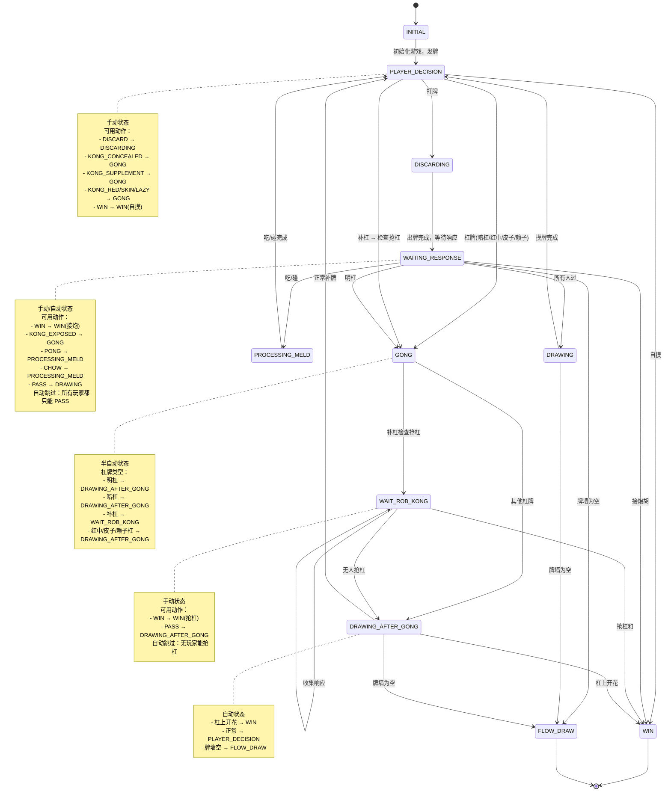

# CLAUDE.md

此文件为 Claude Code (claude.ai/code) 提供在此代码库中工作的指导。

## Conda 环境

项目使用 conda 管理依赖：

- **Conda 路径**: `D:\DATA\Development\Anaconda\condabin\conda.bat`
- **环境名称**: `PettingZooRLMahjong`

### 激活环境

**本地终端：**
```bash
D:\DATA\Development\Anaconda\condabin\conda.bat activate PettingZooRLMahjong
```

**在 Claude Code Bash 工具中运行命令：**

方式一：直接使用环境中的 Python（推荐，更简洁）：
```bash
"D:\DATA\Development\Anaconda\envs\PettingZooRLMahjong\python.exe" your_script.py
```

方式二：通过 conda 激活环境：
```bash
"D:\DATA\Development\Anaconda\condabin\conda.bat" activate PettingZooRLMahjong && python your_script.py
```

> **注意**：在 Bash 工具中使用 Windows 路径时，必须用引号包裹路径，避免反斜杠被转义。方式二中使用 `&&` 连接多个命令。

## 开发命令

### 运行游戏
```bash
# 人类 vs AI（命令行模式）
python play_mahjong.py --mode human_vs_ai --renderer cli

# 人类 vs AI（Web 界面，端口 8000）
python play_mahjong.py --mode human_vs_ai --renderer web --port 8000

# 四人人类游戏（热座模式）
python play_mahjong.py --mode four_human --renderer web --port 8000

# AI 观察模式
python play_mahjong.py --mode observation --renderer web --port 8000
```

### 运行测试
```bash
# 运行特定的集成测试
python tests/integration/test_win_by_discard.py
python tests/integration/test_rob_kong.py
python tests/integration/test_auto_skip_state.py

# 状态机测试
python test_state_machine.py

# 日志系统测试
python test_logging_system.py

# FastAPI/服务器测试
python test_fastapi.py
python test_server_simple.py
```

### 构建 C++ 扩展
```bash
# 构建和牌检测 C++ 扩展（需要 pybind11）
python setup.py build_ext --inplace
```

### 安装依赖
```bash
# 安装 Python 依赖
pip install -r requirements.txt

# 构建 C++ 扩展需要
pip install pybind11
```

## 架构概览

### 状态机模式（核心）

整个游戏由 `src/mahjong_rl/state_machine/` 中的状态机驱动。这是系统的核心——所有游戏流程都通过预定义的状态转换。

**状态分类：**
- **手动状态**（需要 agent 动作）：`PLAYER_DECISION`、`DISCARDING`
- **自动状态**（自动推进）：`DRAWING`、`WAITING_RESPONSE`、`PROCESSING_MELD`、`GONG`、`DRAWING_AFTER_GONG`
- **终端状态**：`WIN`、`FLOW_DRAW`

**关键理解：** 状态机维护一个 `GameContext` 对象，包含所有游戏状态。实现功能时，通常需要：
1. 确定需要修改哪个状态
2. 更新该状态的 `enter()` 或 `step()` 方法
3. 确保正确更新 context

### 组件组织结构

```
src/mahjong_rl/
├── core/              # 不可变游戏数据结构（GameContext、PlayerData、MahjongAction）
├── state_machine/     # 游戏流程编排
├── rules/             # 武汉麻将规则实现（和牌检测、计分、动作验证）
├── observation/       # 为 RL agent 转换状态为观测
├── agents/            # 玩家策略（人类、随机、可扩展自定义 AI）
├── manual_control/    # 人类游戏的 CLI 和 Web 控制器
├── logging/           # 综合日志系统（文件、游戏录制、性能监控）
├── visualization/     # 渲染组件
└── web/               # Web 界面的 FastAPI 服务器
```

### 关键设计模式

1. **状态机**：管理所有游戏阶段的中央协调器
2. **策略模式**：通过 `agents/` 目录实现可插拔的玩家策略
3. **观察者模式**：多种日志记录器类型（文件、游戏录制器、性能监控器）
4. **依赖注入**：状态机接受规则引擎和观测构建器作为依赖

### 核心数据结构

- **GameContext** (`core/GameData.py`)：包含所有游戏状态（玩家、牌、弃牌堆、副露等）。此对象在状态机中传递。
- **MahjongAction** (`core/mahjong_action.py`)：所有动作表示为 `(action_type, parameter)` 元组
- **ActionType** (`core/constants.py`)：所有可能动作的枚举（DISCARD、PONG、KONG、WIN 等）

### PettingZoo 集成

主入口是 `example_mahjong_env.py` 中的 `WuhanMahjongEnv`，它将状态机包装在 PettingZoo AECEnv 接口中。

**重要：** 环境会自动推进自动状态，直到到达手动状态或终端。这意味着 agent 只在 `PLAYER_DECISION` 和 `DISCARDING` 状态下做出决策。

## 武汉麻将规则

**详细规则文档：** `src/mahjong_rl/rules/wuhan_mahjong_rule_engine/wuhan_mahjong_rules.md`

完整的武汉麻将（七皮四赖子玩法）规则请参考上述文档，包括胡牌规则、计分规则、流局处理等详细说明。

### 特殊牌定义
- **赖子（万能牌）**：由翻牌决定（翻牌数字+1，9→1；风牌按"东→南→西→北→中→发→白→东"循环）
  - 可替代任何万、条、筒、风牌组成面子或将牌
  - 不可被吃、碰、杠
  - 胡牌时手牌中赖子数量有限制（小胡≤1个，大胡≤2个）

- **皮**：翻牌及翻牌数字-1的牌（1→9）
  - 仅用于计分
  - 不可被吃、碰、杠（不包含皮子杠）
  - 胡牌时皮不能存在于手牌

- **红中**：固定特殊牌
  - 不能碰、明杠、暗杠
  - 胡牌时红中不能存在于手牌

### 开口规则
- **开口**：通过**吃、碰、明杠、补杠**亮明牌组
- **重要**：胡牌必须满足开口条件
- **不算开口**：暗杠、赖子杠、红中杠、皮子杠

### 杠牌类型
**普通杠（需要4张牌）：**
- **明杠（KONG_EXPOSED）**：手牌 3 张 + 其他玩家打出 1 张（算开口，不能被抢杠）
- **暗杠（KONG_CONCEALED）**：手牌 4 张（不亮明，不算开口，不能被抢杠）
- **补杠（KONG_SUPPLEMENT）**：已经碰了，又摸到第 4 张（算开口，可以被抢杠）

**特殊杠（打出一张即为杠，无需四张）：**
- **赖子杠（KONG_LAZY）**：打出一张赖子，即为赖子杠
- **皮子杠（KONG_SKIN）**：打出一张皮子，即为皮子杠
- **红中杠（KONG_RED）**：打出一张红中，即为红中杠

### 胡牌基本条件
1. **必须开口**：至少完成一次吃、碰、明杠或补杠
2. **牌型结构**：标准胡牌为 4 面子 + 1 将牌（特殊牌型除外）
3. **赖子限制**：小胡最多 1 个，大胡最多 2 个
4. **特殊牌处理**：胡牌时手牌中不能有皮或红中

### 胡牌类型
**小胡（屁胡）：**
- **硬胡**：将牌必须为 2、5、8，不使用赖子（或赖子还原）
- **软胡**：将牌必须为 2、5、8，使用 1 个赖子

**大胡：**
- **全求人**：4 面子均鸣牌得来，手牌仅剩 1 张，只能接炮胡
- **清一色**：全部牌为同一花色（万/条/筒）
- **碰碰胡**：面子均为刻子或杠
- **风一色**：全部牌为风牌（东南西北发白），无需组成面子和将
- **将一色**：全部牌为 2、5、8，无需组成面子和将
- **杠上开花**：杠后补牌自摸胡牌
- **海底捞月**：摸牌墙最后 4 张自摸胡牌
- **抢杠胡**：抢他人补杠牌胡牌

### 特殊胡牌方式
- **杠上开花**：完成任意杠后，从杠尾摸牌自摸胡牌
- **抢杠胡**：仅针对补杠，抢杠优先级高于杠牌
- **海底捞月**：牌墙仅剩最后 4 张牌时，自摸胡牌
- **一炮单响**：只能有一个胡牌者，以庄家逆时针为序

### 计分规则（口口翻）
- **基础分**：小胡 1，大胡 10 × 大胡个数
- **番数乘积因子**：
  - 开口次数：每开口一次 ×2
  - 明杠（含红中杠、赖子杠）：每个 ×2
  - 暗杠：每个 ×4
  - 皮子杠：每个 ×2
  - 赖子杠：每个 ×4
  - 红中杠：每个 ×2
  - 硬胡：×2，软胡：×1
  - 自摸：小胡 ×2，大胡 ×1.5
  - 放冲：小胡 ×2，大胡 ×1.5
- **庄闲系数**（仅小胡）：赢家是庄家则所有闲家 ×2，赢家是闲家则庄家 ×2
- **封顶**：普通封顶 300，金顶 400（口口翻 500）

## 重要实现细节

### 自动 PASS 优化
`WAITING_RESPONSE` 状态实现了智能响应收集：
- `active_responders`：实际需要做决策的玩家列表
- 只能 PASS 的玩家会被自动跳过
- 这减少了约 25% 的训练时间

### 状态回滚
状态机维护最多 100 个快照用于调试：
```python
context = state_machine.rollback(n)  # 回滚 n 步
```

### 懒加载观测构建
观测只在需要时构建（在手动状态的 `enter()` 中），而不是每一步都构建。

### C++ 和牌检测
`mahjong_win_checker` 模块是编译的 C++ 扩展，用于快速和牌检测。修改后需运行 `python setup.py build_ext --inplace` 重新构建。

## 测试约定

- 集成测试位于 `tests/integration/`
- 测试文件通常直接用 Python 运行（不是 pytest）
- 测试经常创建最小化的 GameContext 实例来测试特定场景

## Web 界面

FastAPI 服务器（`src/mahjong_rl/web/`）提供实时 Web 界面，使用 WebSockets 进行实时游戏状态更新。Web 控制器位于 `src/mahjong_rl/manual_control/web_controller.py`。

## 常见任务

实现新功能时：
1. 确定需要在 `state_machine/states/` 中修改哪个状态
2. 如果规则改变，更新 `rules/wuhan_mahjong_rule_engine/` 中的规则引擎方法
3. 在 `tests/integration/` 中添加相应测试
4. 如果需要向 agent 暴露新的状态信息，更新观测构建器

## 文件位置参考

- 环境入口点：`example_mahjong_env.py`
- 游戏入口点：`play_mahjong.py`
- 状态机：`src/mahjong_rl/state_machine/machine.py`
- 规则引擎：`src/mahjong_rl/rules/wuhan_mahjong_rule_engine/wuhan_7p4l_rule_engine.py`
- CLI 控制器：`src/mahjong_rl/manual_control/cli_controller.py`
- Web 控制器：`src/mahjong_rl/manual_control/web_controller.py`

## 状态机转换流程

### 状态分类

**手动状态**（需要 agent 动作）：
- `PLAYER_DECISION` - 玩家决策（打牌、杠牌、自摸和牌）
- `WAITING_RESPONSE` - 等待其他玩家响应（吃/碰/杠/胡/过）
- `WAIT_ROB_KONG` - 等待抢杠和响应（仅补杠时）
- `MELD_DECISION` - 吃牌决策（选择哪种吃法）

**自动状态**（自动推进）：
- `INITIAL` - 初始状态
- `DISCARDING` - 出牌状态
- `PROCESSING_MELD` - 处理吃碰状态
- `GONG` - 杠牌状态（半自动，补杠需检查抢杠）
- `DRAWING` - 摸牌状态
- `DRAWING_AFTER_GONG` - 杠后补牌状态

**终端状态**：
- `WIN` - 和牌
- `FLOW_DRAW` - 流局

### Mermaid 状态图



### 详细状态说明

**INITIAL（初始状态）**
- 职责：初始化游戏，发牌，设置庄家
- 转换：→ PLAYER_DECISION

**PLAYER_DECISION（玩家决策状态 - 手动）**
- 职责：玩家决策（打牌、杠牌、自摸和牌）
- 可用动作：
  - `DISCARD` - 打出一张牌 → DISCARDING
  - `KONG_CONCEALED` - 暗杠 → GONG
  - `KONG_SUPPLEMENT` - 补杠 → GONG → WAIT_ROB_KONG
  - `KONG_RED` - 红中杠 → GONG
  - `KONG_SKIN` - 皮子杠 → GONG
  - `KONG_LAZY` - 赖子杠 → GONG
  - `WIN` - 自摸和牌 → WIN

**DISCARDING（出牌状态 - 自动）**
- 职责：执行打牌，设置响应顺序
- 转换：→ WAITING_RESPONSE

**WAITING_RESPONSE（等待响应状态 - 手动/自动）**
- 职责：收集其他玩家对弃牌的响应
- 可用动作：WIN, KONG_EXPOSED, PONG, CHOW, PASS
- 自动跳过：所有玩家都只能 PASS

**GONG（杠牌状态 - 半自动）**
- 职责：处理所有类型的杠牌
- 明杠/暗杠/特殊杠 → DRAWING_AFTER_GONG
- 补杠 → WAIT_ROB_KONG

**WAIT_ROB_KONG（等待抢杠和状态 - 手动）**
- 职责：检查是否有玩家抢杠和（仅补杠时）
- 抢杠和 → WIN
- 无人抢杠 → DRAWING_AFTER_GONG

**DRAWING（摸牌状态 - 自动）**
- 职责：从牌墙摸牌
- → PLAYER_DECISION 或 FLOW_DRAW

**DRAWING_AFTER_GONG（杠后补牌状态 - 自动）**
- 职责：杠后摸牌，检查杠上开花
- → WIN, PLAYER_DECISION 或 FLOW_DRAW
